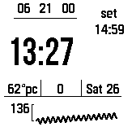
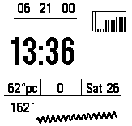
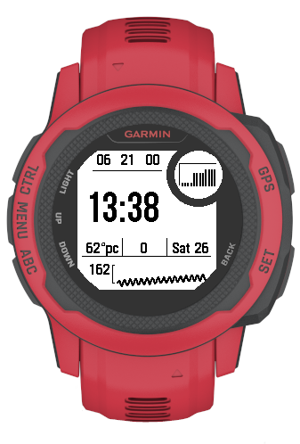

# Instinct 2s Better battery Watchface

This is a battery optimized watchface for instinct 2s. It does all of the layout positioning hardcoded to save battery life. 
I get about 4% consumption per day with this, which is about 10% better than the stock watchfaces. 

I daily drive this watch face and haven't seen any crashes in a long time. 

 

# Features 

1. Live heart-rate. Bottom right corner of the watchface features a live heart rate count. This is updated partially even when the watchface is active to save battery. 
All other parts of the watch face is only drawn once a minute. 
2. Heart-rate graph. Goes back 100 mins and adjusts height as indicated by the left side arm. If the HR data is concentrated on higher or lower end of the spectrum, the graph will adjust to show most granularity. Updates once a minute. 
3. Weather, steps, date. Drawn once a minute right above the live HR and the HR graph.  
4. Time. No seconds to save battery. 
5. 3 timezone hours. Only show hour for different timezones since minutes are the same. Zones are set to, UTC+9, UTC, and UTC+3. These are hardcoded to save battery. 
6. Saliency area: Changes what's displayed based on circumstances. 
    * Picture above is showing sunset. Sunset and sunrise times are cached until the next event to save battery. 
    * If rain is coming this will show a precipitation forecast. Cached 30 mins to save battery. 
    * If battery is low, it will show battery percentage. 
    * If freezing it will show a freezing alert. 

